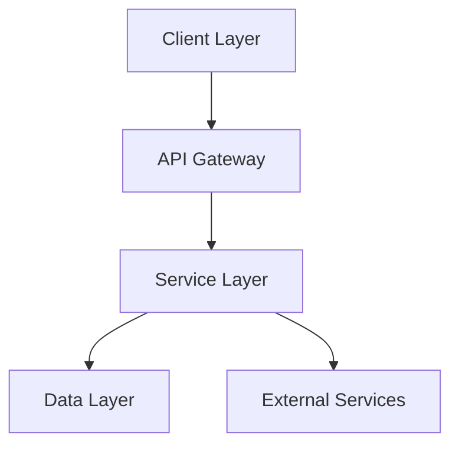
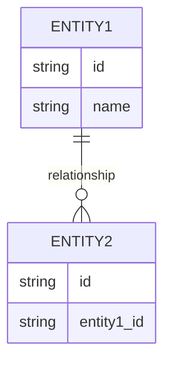
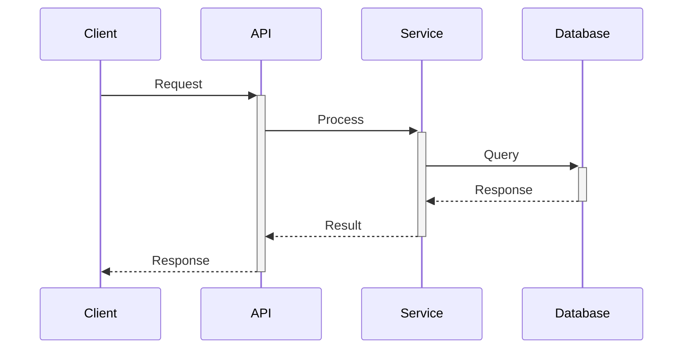

# System Architecture Design

## High-Level Architecture

## Component Breakdown
[List and describe each major component]

## Data Model

## API Design

## Technology Stack Selection
- Frontend: [Technologies]
- Backend: [Technologies]
- Database: [Technologies]
- DevOps: [Technologies]

## Security Considerations
[Security requirements and implementation approach]

> **AI Assistant**: Claude Sonnet for architecture diagrams and Mermaid, GPT-4 for technical stack recommendations