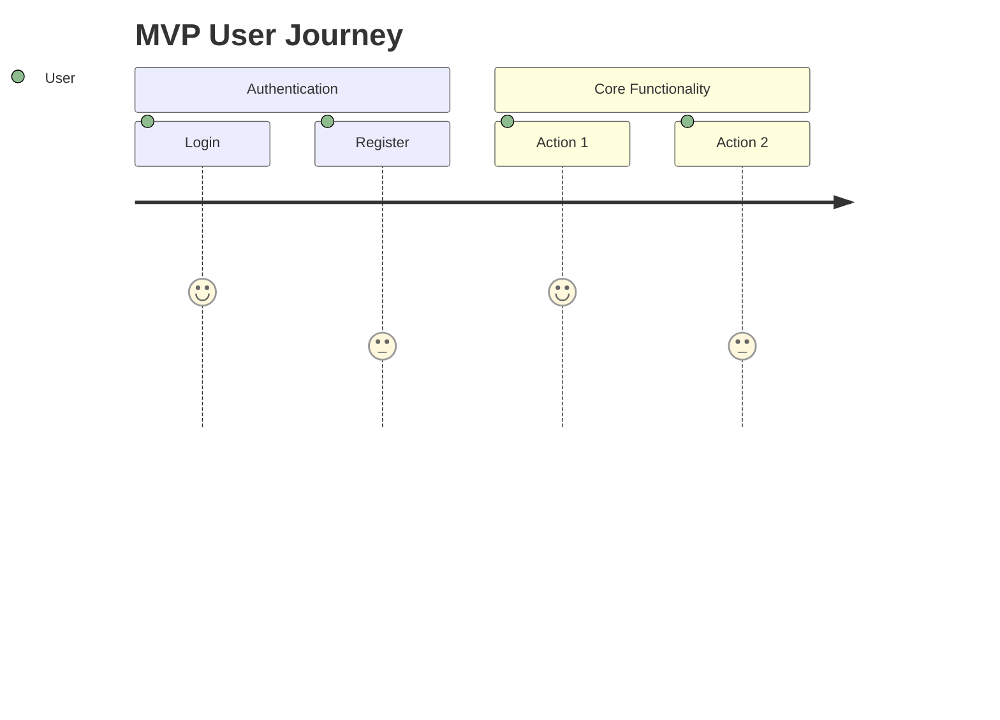

# MVP Definition Document

## Core Features for MVP
1. [Feature 1]
2. [Feature 2]
3. [Feature 3]

## Feature Prioritization Matrix

| Feature | Value | Complexity | Priority |
|---------|-------|------------|----------|
| Feature 1 | High | Medium | 1 |
| Feature 2 | Medium | Low | 2 |
| Feature 3 | High | High | 3 |

## User Journeys for MVP

## Out of Scope for MVP
- [Feature/functionality to be implemented post-MVP]

## Technical Debt Considerations
[Acceptable technical debt for MVP and plan to address]

## MVP Success Metrics
[How to measure MVP success]

> **AI Assistant**: Claude Sonnet for user journey mapping, GPT-4 for feature prioritization