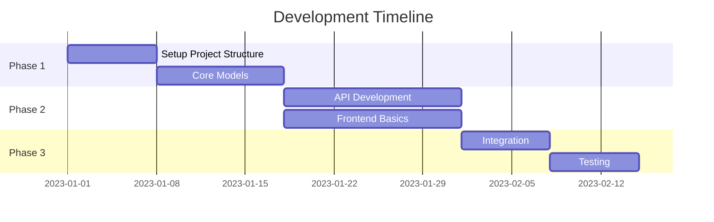

# Development Planning Document

## Project Structure

```
project/
├── frontend/
│   ├── src/
│   │   ├── components/
│   │   ├── pages/
│   │   └── utils/
├── backend/
│   ├── api/
│   ├── services/
│   └── models/
├── docs/
└── tests/
```

## Development Phases



## Development Standards
- Code Style: [Standards]
- Documentation: [Requirements]
- Testing: [Approach]
- CI/CD: [Process]

## Environment Setup
[Instructions for setting up development environment]

> **AI Assistant**: Augment Code for project structure, Claude Sonnet for Gantt charts