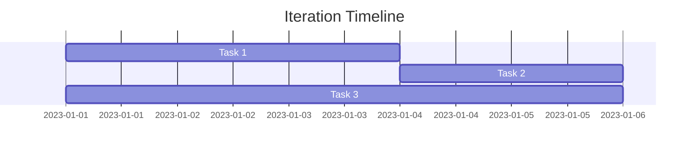

# Iteration Planning Document

## Previous Iteration Review
- Completed: [Tasks completed]
- Challenges: [Challenges encountered]
- Learnings: [Key learnings]

## Current Iteration Goals
1. [Goal 1]
2. [Goal 2]
3. [Goal 3]

## Task Allocation

## Risk Assessment
- **Risk**: [Risk description]
  - Impact: [High/Medium/Low]
  - Mitigation: [Mitigation strategy]

## Definition of Done
[Criteria that must be met for tasks to be considered complete]

> **AI Assistant**: Claude Sonnet for planning and visualization, GPT-4 for risk assessment