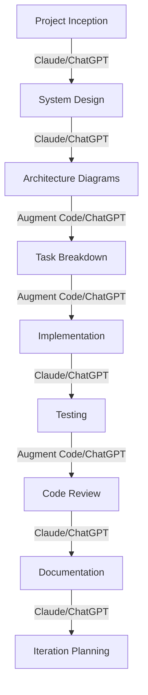

# AI Model Selection Guide

## Project Phase Recommendations

| Project Phase | First Choice | Alternative | Strengths | Limitations |
|---------------|----------------|-----------|-------------|-------------|
| Conceptual Design | Claude Sonnet | ChatGPT | Big-picture thinking, nuanced understanding | May lack technical specificity |
| Architecture | Claude Sonnet | ChatGPT | Excellent with Mermaid diagrams, system design | May need guidance on specific tech stacks |
| Task Breakdown | Augment Code | ChatGPT | Technical precision, code-focused | May miss broader project context |
| Implementation | Augment Code | ChatGPT | Code generation, debugging | Requires clear specifications |
| Testing | Claude Sonnet | Augment Code | Comprehensive test case generation | May generate overly complex tests |
| Documentation | Claude Sonnet | ChatGPT | Clear, well-structured documentation | May be overly verbose |
| Code Review | Augment Code | ChatGPT | Detailed code analysis | Focus may be too narrow |

## AI Collaboration Workflow

## Prompt Engineering Tips
1. **Be specific**: Clearly define what you want the AI to focus on
2. **Provide context**: Include relevant background information
3. **Set constraints**: Define limitations and requirements
4. **Request reasoning**: Ask the AI to explain its thinking
5. **Iterative refinement**: Use multiple rounds to refine outputs

## AI Handoff Process
1. Summarize the output from the previous AI
2. Clearly state what the next AI should focus on
3. Include relevant artifacts from the previous step
4. Specify the expected output format
5. Review and integrate the output before the next handoff

## Model-Specific Considerations

### Claude Sonnet
- **Strengths**: Conceptual thinking, documentation, Mermaid diagrams
- **Best For**: System design, user experience, documentation
- **Prompt Tips**: Be conversational, provide context, ask for reasoning

### Augment Code
- **Strengths**: Code generation, technical precision, debugging
- **Best For**: Implementation, code review, technical problem-solving
- **Prompt Tips**: Be specific about technical requirements, provide examples

### ChatGPT
- **Strengths**: Versatility, code generation, explanations
- **Best For**: General-purpose tasks, alternatives when specialized models aren't available
- **Prompt Tips**: Use system prompts to define role, be explicit about format requirements

## Choosing Between Models

When deciding which AI to use for a specific task, consider:

1. **Task complexity**: More complex conceptual tasks may benefit from Claude Sonnet
2. **Technical specificity**: Code-heavy tasks typically work better with Augment Code
3. **Visual requirements**: Tasks requiring diagrams work well with Claude Sonnet
4. **Iteration speed**: Consider how quickly you need responses
5. **Context length**: Some models handle longer contexts better than others
6. **Previous experience**: Use models that have performed well on similar tasks

## Fallback Strategy

If your preferred model is unavailable or underperforming:

1. **Simplify the task**: Break it into smaller, more manageable chunks
2. **Provide more context**: Give additional background information
3. **Use examples**: Provide examples of expected output
4. **Try alternative phrasing**: Reword your prompt to be more explicit
5. **Switch models**: Move to your alternative model with the same prompt

## Measuring AI Effectiveness

Track these metrics to optimize your AI usage:

1. **Iteration count**: How many prompt revisions were needed
2. **Implementation accuracy**: How much human correction was required
3. **Time savings**: Time saved compared to traditional methods
4. **Quality improvement**: Improvements in code quality or documentation
5. **Knowledge transfer**: How effectively the AI explained its reasoning